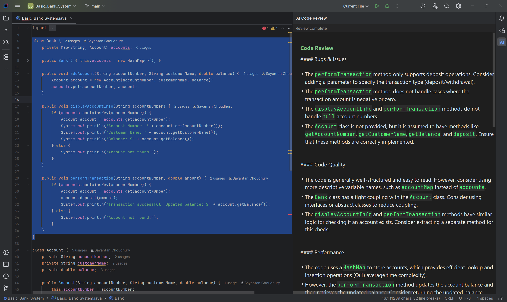

# AI Code Reviewer — IntelliJ IDEA Plugin

An IntelliJ IDEA plugin that sends selected code to the **Groq API** (LLaMA 3.3 70B) and displays a structured AI-powered code review in a dedicated tool window — without leaving the IDE.

---

## Screenshot



---

## Features

- **Right-click to review** — select any code, right-click, choose *Review Code with AI*
- **Structured analysis** covering five dimensions: bugs, code quality, performance, best practices, and actionable improvements
- **Language-aware** — detects 20+ languages from file extension and includes it in the prompt
- **Persistent tool window** — results appear in a docked side panel with a dark theme, markdown rendering, and syntax-highlighted code blocks
- **Loading state** — indeterminate progress bar while the API call is in flight
- **Secure API key storage** — key is saved to the OS keychain via IntelliJ's `PasswordSafe`, never written to disk in plain text
- **Settings page** — configure API key and model at *Settings → Tools → AI Code Reviewer*

---

## Tech Stack

| Layer | Technology |
|---|---|
| Language | Java 21 |
| IDE Platform | IntelliJ Platform SDK 2025.1 (IC) |
| Build | IntelliJ Platform Gradle Plugin 2.7.1 |
| AI provider | [Groq API](https://console.groq.com) |
| Model | `llama-3.3-70b-versatile` |
| HTTP client | `java.net.http.HttpClient` (JDK 11+) |
| JSON | Jackson `jackson-databind` 2.18 |
| Credential storage | IntelliJ `PasswordSafe` + `CredentialAttributes` |

---

## Getting Started

### Prerequisites

- IntelliJ IDEA (Community or Ultimate) 2025.1+
- JDK 21
- A [Groq API key](https://console.groq.com) (free tier available)

### Build and run

```bash
# Clone the repository
git clone https://github.com/RogerCorcoles/ai-code-reviewer.git
cd ai-code-reviewer

# Launch a sandboxed IDE instance with the plugin loaded
./gradlew runIde
```

Gradle downloads the target IntelliJ platform automatically on first build.

### Build a distributable `.zip`

```bash
./gradlew buildPlugin
# Output: build/distributions/ai-code-reviewer-1.0-SNAPSHOT.zip
```

Install it in any IntelliJ-based IDE via *Settings → Plugins → ⚙ → Install Plugin from Disk*.

---

## Configuration

1. Open *Settings* (`Ctrl+Alt+S` / `⌘,`)
2. Navigate to **Tools → AI Code Reviewer**
3. Paste your Groq API key
4. Optionally change the model name (default: `llama-3.3-70b-versatile`)
5. Click **Apply**

The key is stored in the OS keychain (Windows Credential Manager / macOS Keychain / libsecret on Linux) via IntelliJ's `PasswordSafe`. It is never written to the settings XML file.

---

## Usage

1. Open any source file in the editor
2. Select one or more lines of code
3. Right-click → **Review Code with AI**
4. The *AI Code Review* panel opens on the right and shows a spinner while the request is in flight
5. The structured review appears as soon as the model responds

---

## Architecture

```
src/main/java/com/rogercm/aicodereviewer/
│
├── actions/
│   └── ReviewCodeAction.java        Entry point. Reads selection, shows the tool
│                                    window, starts the background task.
│
├── api/
│   └── GroqApiClient.java           Builds the JSON request, calls the Groq
│                                    completions endpoint, and parses the response.
│
├── model/
│   └── ReviewResult.java            Immutable value object — either a success
│                                    (content string) or an error (message string).
│
├── services/
│   └── ReviewService.java           Project-scoped service (declared in plugin.xml).
│                                    Holds the live ReviewToolWindow reference so the
│                                    background thread can update the UI after the
│                                    tool window is created.
│
├── settings/
│   ├── AppSettingsState.java        PersistentStateComponent — stores the model name
│   │                                in XML; delegates the API key to PasswordSafe.
│   ├── AppSettingsComponent.java    Swing form (password field + text field).
│   └── AppSettingsConfigurable.java Connects the form to the settings state;
│                                    registered under Settings → Tools.
│
└── ui/
    ├── ReviewToolWindow.java         Dark-themed panel with a CardLayout that
    │                                 switches between the loading spinner and the
    │                                 HTML result pane. Converts markdown to HTML.
    └── ReviewToolWindowFactory.java  ToolWindowFactory (DumbAware) — called once
                                      by the platform when the panel is first shown;
                                      creates ReviewToolWindow and registers it with
                                      ReviewService.
```

---

## Design Decisions

**Why Groq instead of OpenAI?**
Groq's inference hardware (LPU) delivers significantly lower latency for large models. For an interactive IDE tool where the user is waiting for a response, speed matters more than marginal model quality differences. The Groq API is OpenAI-compatible, so the request format is standard JSON.

**Why a `ReviewService` project service?**
The tool window is created lazily by `ReviewToolWindowFactory` on first display. The background HTTP thread needs to reference the panel to update it after the API call completes. A project-scoped service acts as a stable rendezvous point between the factory (which sets the reference) and the action (which reads it), without using a static singleton that would break multi-project setups.

**Why not `@Service` annotation?**
IntelliJ's rule: a service must not use both the `@Service` annotation and a `plugin.xml` declaration. Using both causes `project.getService()` to malfunction, returning `null` and producing a silent NPE that leaves the tool window empty ("Nothing to show"). The plugin uses explicit `plugin.xml` registration only.

**Why embed CSS in each HTML document instead of `HTMLEditorKit.getStyleSheet()`?**
`HTMLEditorKit.getStyleSheet()` returns the **IDE-wide shared stylesheet**. Calling `addRule()` on it mutates global state and corrupts HTML rendering across the entire IDE for the session. Embedding a `<style>` block in each HTML document's `<head>` keeps the styling fully self-contained.

**Why `DumbAware` on the factory and action?**
Without `DumbAware`, IntelliJ defers `createToolWindowContent()` until the project finishes indexing (smart mode). If the user triggers the action during indexing, the tool window opens empty. Implementing `DumbAware` forces immediate initialization regardless of indexing state.

---

## License

MIT
